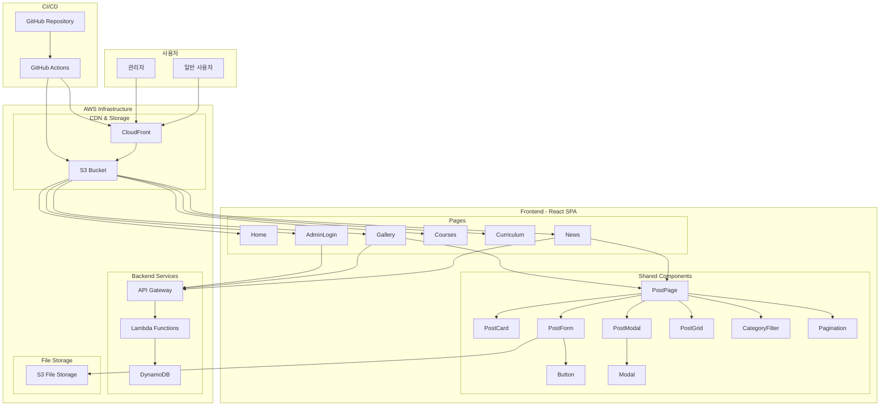
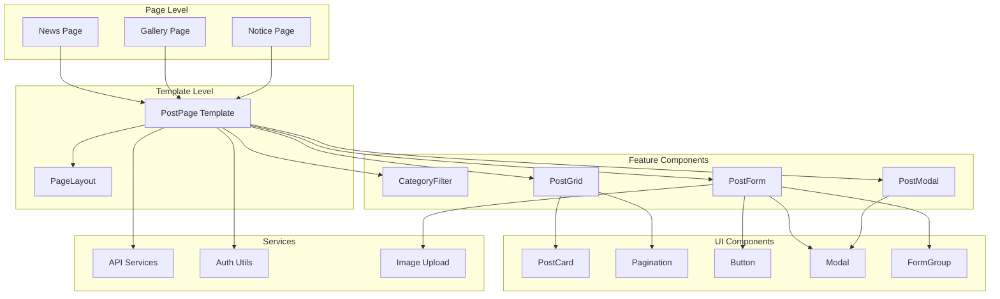
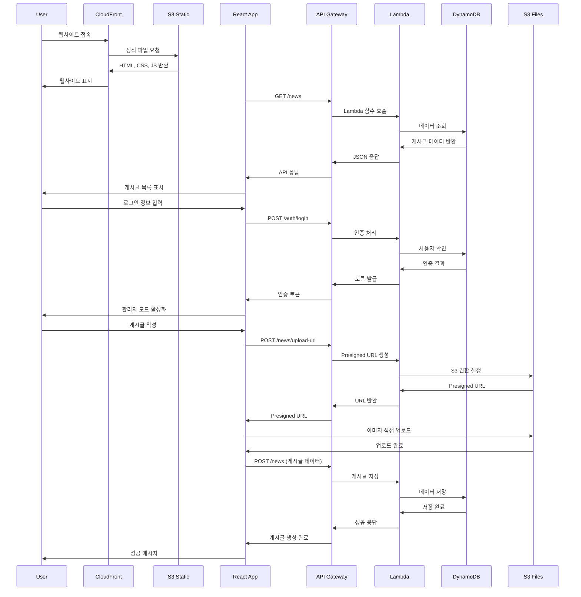
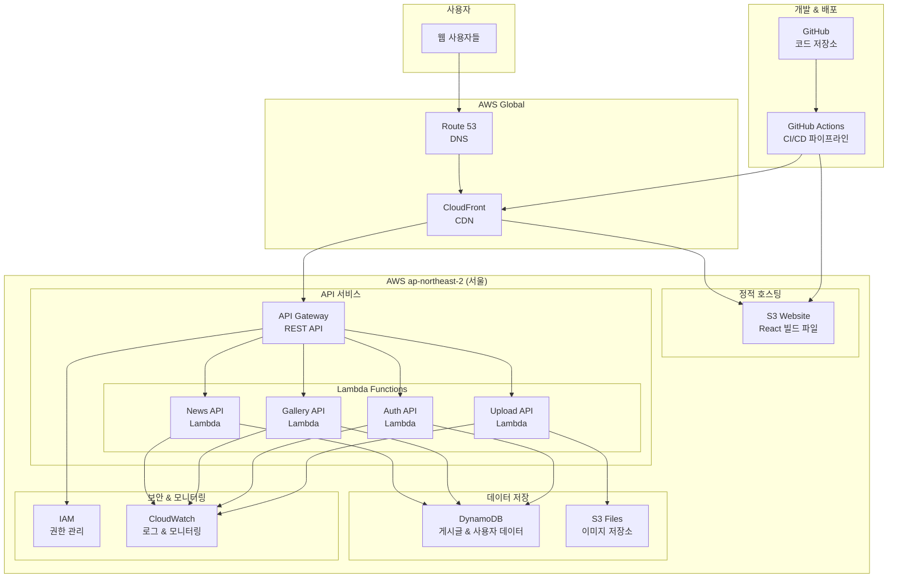
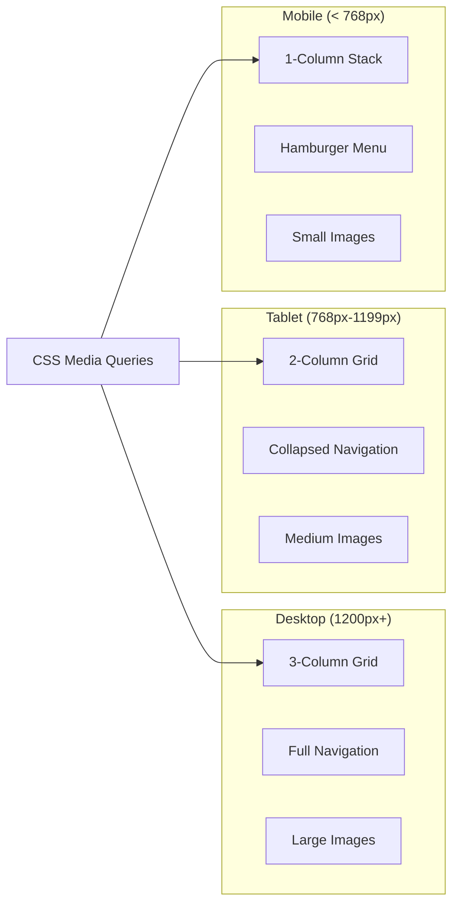
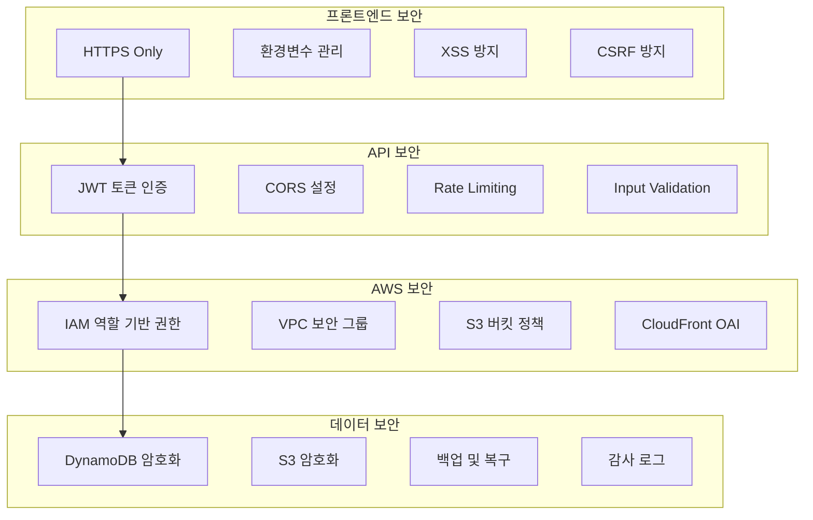
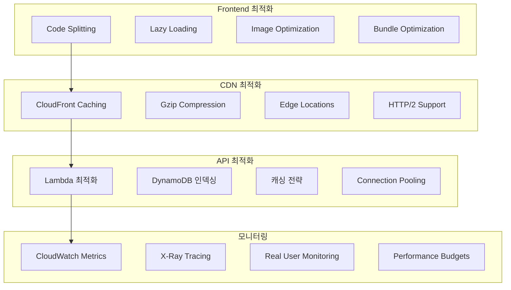

# 🏗️ 가족지원센터 웹사이트 아키텍처

## 📊 전체 시스템 아키텍처

## 🧩 컴포넌트 구조 다이어그램

## 🔄 데이터 플로우 다이어그램

## 🏗️ AWS 인프라 구조

## 📱 반응형 디자인 구조

## 🔒 보안 아키텍처

## 📊 성능 최적화 구조

---

이 아키텍처는 확장 가능하고 유지보수가 용이하며, 현대적인 웹 개발 모범 사례를 따릅니다.

**작성일**: 2025년 7월 6일  
**버전**: 2.0.0
